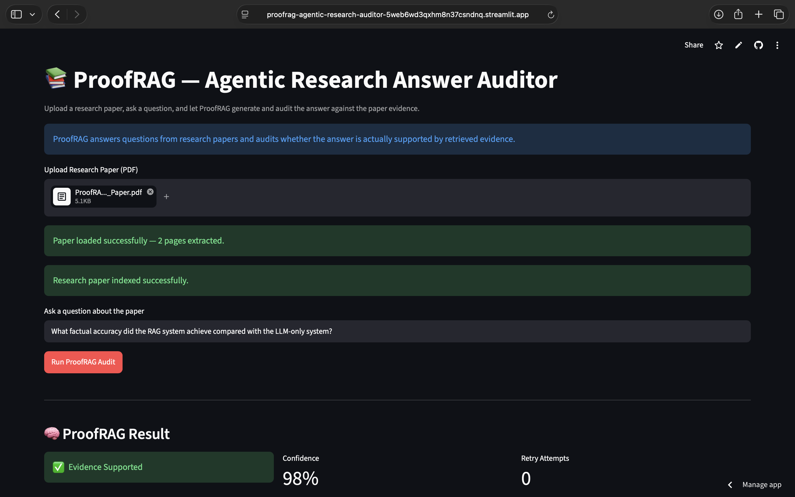
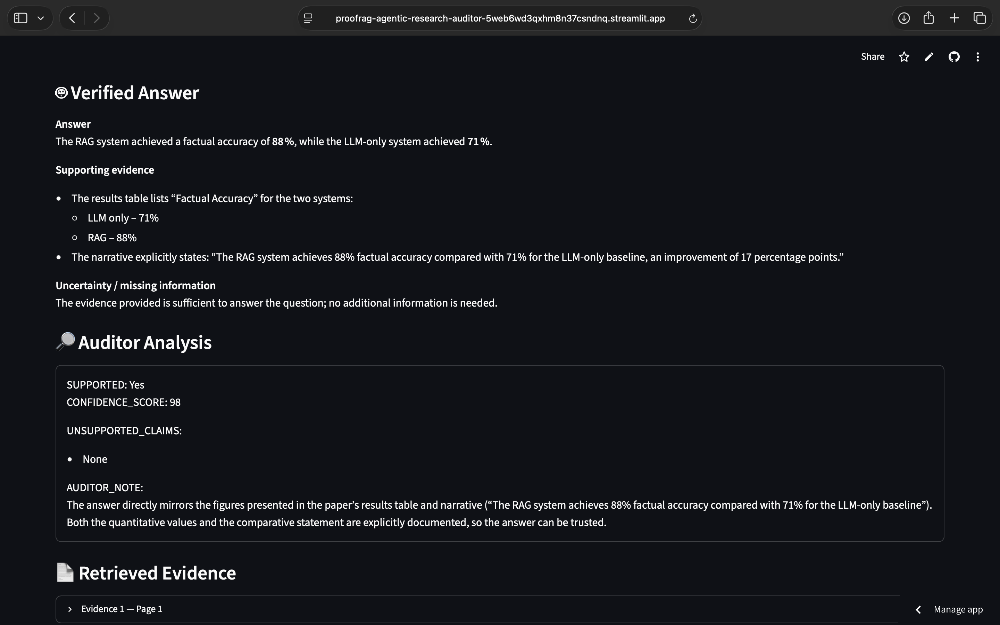

# 🔎 ProofRAG — Agentic Research Answer Auditor

ProofRAG is an agentic RAG application that answers questions from research papers and audits whether the generated answer is actually supported by the retrieved evidence.

Instead of blindly trusting an LLM response, ProofRAG retrieves relevant evidence, generates an answer, evaluates its reliability, and automatically retries when confidence is low.

## 🚀 Live Demo

🔗 **Try ProofRAG:** [Launch ProofRAG](https://proofrag-agentic-research-auditor-5web6wd3qxhm8n37csndnq.streamlit.app/)

Upload a research PDF, ask a question, and ProofRAG will retrieve relevant evidence, generate an answer, audit its reliability, and display supporting evidence.

## 📸 Application Preview

### Research Paper Q&A Interface

!

### Evidence-Audited Answer



## ✨ Features

- Upload research papers in PDF format
- Ask natural-language questions about the paper
- Semantic evidence retrieval using FAISS
- Local LLM inference using Llama 3.2 + Ollama
- Evidence-grounded answer generation
- Independent answer auditing
- Confidence scoring
- Detection of unsupported claims
- LangGraph conditional retry workflow
- Page-level evidence display
- Runs locally without a paid LLM API

## 🧠 How It Works

PDF Upload  
↓  
Text Extraction & Chunking  
↓  
Embedding Generation  
↓  
FAISS Vector Search  
↓  
Relevant Evidence Retrieval  
↓  
LLM Answer Generation  
↓  
Evidence Auditor  
↓  
Confidence Check  
↓  
Low Confidence? → Retry Retrieval & Audit  
↓  
Verified Answer + Evidence

## 🛠 Tech Stack

- Python
- Streamlit
- LangChain
- LangGraph
- Ollama
- Groq-hosted model
- Cloud LLM inference using Groq
- FAISS
- Sentence Transformers
- PyPDF

## 🎯 Why ProofRAG?

LLMs can generate confident answers even when the available source does not support them.

ProofRAG adds an evidence-auditing layer to the RAG pipeline. It checks whether an answer is grounded in the uploaded research paper and identifies cases where evidence is insufficient.

## 🧪 Example

**Question**

> Which company funded this research and how much funding did they provide?

When the information is not present in the uploaded paper, ProofRAG avoids inventing an answer and flags the response as unsupported or low-confidence.

## 🔄 Agentic Workflow

ProofRAG uses LangGraph to control the research workflow.

If the auditor assigns a low confidence score, the workflow can automatically route the request through another retrieval and answer-generation pass before producing the final result.

## 📂 Project Structure

```text
proofrag-agentic-research-auditor/
├── app.py
├── requirements.txt
├── README.md
├── .gitignore
├── data/
└── src/
    ├── answer_agent.py
    ├── evidence_auditor.py
    ├── llm.py
    ├── pdf_loader.py
    ├── retriever.py
    └── workflow.py